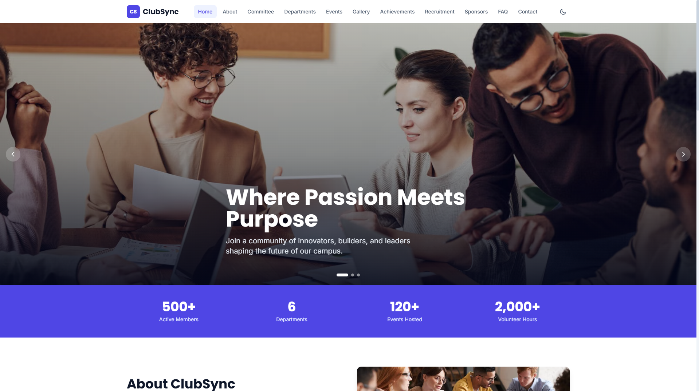
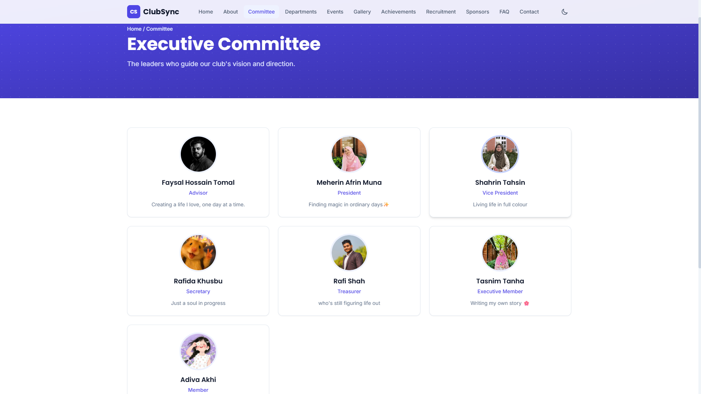
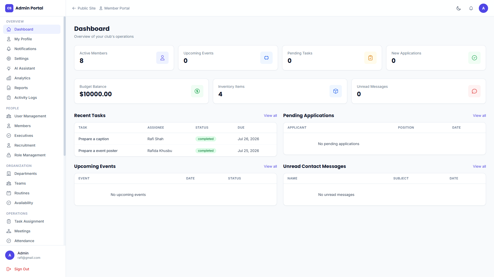
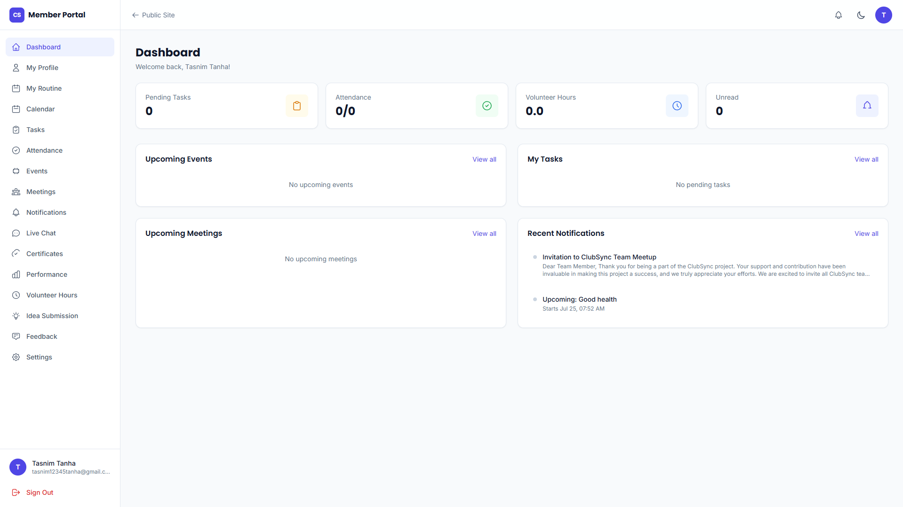

# ClubSync

A full-stack club management web application with a public website, a self-service **Member Portal**, and a role-based **Admin Portal**. Built with React/Vite (TypeScript) on the frontend and Supabase (PostgreSQL, Row-Level Security, Edge Functions, Realtime) on the backend.

---

## Table of Contents

- [Features](#features)
- [Tech Stack](#tech-stack)
- [Project Structure](#project-structure)
- [Prerequisites](#prerequisites)
- [Getting Started](#getting-started)
- [Environment Variables](#environment-variables)
- [Database & Migrations](#database--migrations)
- [Edge Functions](#edge-functions)
- [Roles & Permissions (RBAC)](#roles--permissions-rbac)
- [Notification System](#notification-system)
- [Available Scripts](#available-scripts)
- [Deploying to a New Machine](#deploying-to-a-new-machine)
- [Security Notes](#security-notes)

---

## Features

### Public Website
- Home, About, Committee, Departments, Events, Gallery, Achievements, Recruitment, Sponsors, Contact, FAQ
- Public visitors (not logged in) can browse committee members, departments, public events, gallery, and submit recruitment applications / contact messages

### Member Portal (`/portal`)
- Dashboard with personal stats (tasks, attendance, volunteer hours, notifications)
- My Profile (view/edit name, phone, avatar, bio)
- My Routine — self-service weekly class/schedule editor with **CSV bulk import** and overlap-prevention (DB-enforced, no double-booked time slots)
- Calendar, Tasks, Attendance history, Event registration, Meeting schedule
- Certificates, Performance history, Volunteer hours logging
- Idea submission, Feedback
- Live Chat (direct messages between members — private, not visible to other members or admins)
- Settings — dark mode, notification preferences (email / push / event reminders / task deadlines)

### Admin Portal (`/admin`)
- Dashboard with live org-wide stats
- **Role-based access control**: every nav item and route is gated by a real permission (see [Roles & Permissions](#roles--permissions-rbac)) — not just a hardcoded role list
- Member, User, Executive, Department, Team, Recruitment management
- Task assignment, Meeting management, Attendance tracking, Performance records
- Events, Budgets, Inventory, Resource booking, Certificate generation
- Reports, Analytics, Activity Logs
- Website CMS (site settings, about content, gallery)
- Live Chat, Group Chat, Broadcast messaging
- Import/Export (CSV)
- AI Assistant
- Role Management — toggle granular permissions per role, with a confirmation step before revoking a permission that could remove your own access

---

## Tech Stack

| Layer | Technology |
|---|---|
| Frontend | React + Vite (TypeScript), React Router, Tailwind CSS |
| Backend | Supabase (PostgreSQL, Row-Level Security, Realtime, Edge Functions) |
| Auth | Supabase Auth |
| Scheduled jobs | pg_cron (Postgres extension) |
| Email | Resend (via Edge Function) |
| Push notifications | Web Push API + VAPID (service worker) |

---

## Project Structure

```
src/
  components/
    admin/          # AdminLayout, AdminUI (shared table/form components), RequirePermission
    member/          # MemberLayout, MemberUI
    PublicLayout.tsx
  context/
    AuthContext.tsx  # session, member profile, roles, permissions (hasPermission)
    ThemeContext.tsx
  lib/
    supabase.ts      # Supabase client
    adminApi.ts       # All admin-portal data access functions
    memberApi.ts       # All member-portal data access functions
    api.ts             # Public site data access (contact, recruitment)
    csv.ts             # CSV parse/serialize/download helpers
    routineTime.ts     # Day/time parsing + overlap detection for routines
    storage.ts          # File upload helper
  pages/
    (public site pages)
    admin/            # One file per admin feature/page
    member/            # One file per member-portal feature/page
  App.tsx              # All routes
public/
  sw.js                # Service worker for push notifications
supabase/
  migrations/          # All SQL migrations, timestamp-ordered
  functions/
    create-member-account/   # Admin-only: creates a login + member + role in one step
    ai-assistant/              # AI Assistant backend
    send-email/                 # Sends transactional email via Resend
```

---

## Prerequisites

- **Node.js** 18+ and npm ([nodejs.org](https://nodejs.org))
- A **Supabase** project (free tier is fine to start)
- **Supabase CLI** (`npm install -g supabase`) if you want to manage migrations/functions from the command line
- A **Resend** account (free tier) if you want email notifications working

---

## Getting Started

```bash
# 1. Install dependencies
npm install

# 2. Copy environment variables (see below) into a .env file at the project root

# 3. Run the dev server
npm run dev
```

The app will be available at the local URL shown in the terminal (typically `http://localhost:5173`).

---

## Environment Variables

Create a `.env` file in the project root:

```env
VITE_SUPABASE_URL=https://your-project-ref.supabase.co
VITE_SUPABASE_ANON_KEY=your-anon-key

# Required only if Push Notifications are enabled
VITE_VAPID_PUBLIC_KEY=your-vapid-public-key
```

Find `VITE_SUPABASE_URL` and `VITE_SUPABASE_ANON_KEY` under **Supabase Dashboard → Project Settings → API**.

> **Never commit `.env` to version control.** It's excluded via `.gitignore` by default.

---

## Database & Migrations

All schema changes live in `supabase/migrations/`, applied in timestamp order. To apply them to your Supabase project:

```bash
supabase login
supabase link --project-ref your-project-ref
supabase db push
```

If the CLI warns about migrations being inserted before the latest applied one, rerun with `--include-all`.

You can also run any individual `.sql` file directly in **Supabase Dashboard → SQL Editor** if you prefer not to use the CLI.

### Row-Level Security

Every table has RLS enabled. Access is generally scoped as:
- **Public tables** (events marked public, departments, committee, gallery, achievements, sponsors, FAQs, site content): readable by anyone, including logged-out visitors (`anon` role)
- **Member-scoped data** (tasks, attendance, routines, etc.): each member can read/write their own rows only
- **Admin-scoped data**: gated by the `is_admin_user()` SQL helper function
- **Direct messages**: private to the two participants — not even admins can read them

---

## Edge Functions

Deploy with the Supabase CLI:

```bash
supabase functions deploy create-member-account
supabase functions deploy ai-assistant
supabase functions deploy send-email
```

| Function | Purpose |
|---|---|
| `create-member-account` | Admin-only. Creates an auth login + `members` row + role assignment in one step. Requires the caller to hold an admin-tier role. |
| `ai-assistant` | Powers the Admin Portal's AI Assistant page. |
| `send-email` | Sends transactional email via [Resend](https://resend.com). Requires the `RESEND_API_KEY` secret. |

Set required secrets:

```bash
supabase secrets set RESEND_API_KEY=your-resend-api-key
```

---

## Roles & Permissions (RBAC)

Admin-portal access is controlled by real, editable permissions — not a hardcoded list of role names:

- `roles`, `permissions`, and `role_permissions` tables define what each role can do
- `AuthContext` loads the current user's effective permission set on login (`hasPermission(slug)`)
- The special `portal.admin` permission controls whether a role can enter `/admin` at all
- Each admin nav item and route checks a specific permission slug (e.g. `budgets.view`, `roles.manage`) — a role without that permission won't see the nav item, and can't reach the route directly by URL either
- Manage roles/permissions from **Admin Portal → Role Management**

**Note:** disabling a permission takes effect on the affected user's *next* login/session refresh, not instantly mid-session.

---

## Notification System

Three preferences live in **Settings → Notification Preferences**, each backed by a real feature:

| Preference | How it works |
|---|---|
| **Event Reminders** | A scheduled Postgres function (`send_event_reminders`, via `pg_cron`, every 15 min) creates an in-app notification ~24h before an event a member is registered for. |
| **Task Deadlines** | Same pattern (`send_task_deadline_reminders`) for tasks approaching their due date. |
| **Email Notifications** | When enabled, the same reminder functions also call the `send-email` Edge Function (via `pg_net`) to deliver the reminder by email through Resend. |
| **Push Notifications** | Toggling this on requests browser permission and registers a push subscription (`push_subscriptions` table). Requires `VITE_VAPID_PUBLIC_KEY` to be set. |

If your Supabase project doesn't have `pg_cron` available, the reminder functions can still be triggered manually (`SELECT send_event_reminders();`) or from a Supabase Edge Function scheduled via the Dashboard's Cron Triggers instead.

---

## Available Scripts

```bash
npm run dev         # Start the Vite dev server
npm run build        # Type-check and build for production
npm run preview       # Preview the production build locally
npm run typecheck      # Run TypeScript checks only
```

---

## Deploying to a New Machine

1. Copy the project folder (skip `node_modules` and `dist` — regenerate with `npm install`)
2. Copy your `.env` file separately (it's git-ignored, won't come with a `git clone`)
3. `npm install`
4. `npm run dev`

Since the backend is entirely hosted on Supabase, any machine with the same `.env` connects to the same live database — no local database setup needed.

---

## Security Notes

- `.env` and any file containing a **Supabase service role key** (e.g. a filled-in migration using it for `pg_net` calls) should never be committed to a public repository — a leaked service role key bypasses all Row-Level Security.
- Direct messages between members are private by design, enforced at the database level — this was a deliberate security fix; don't reintroduce broad `is_admin_user()` read access to the `messages`/`conversations` tables for direct-type conversations.
- The `create-member-account` Edge Function is intentionally locked down to admin-tier callers only — it can create arbitrary logins and must never be called from unauthenticated context.

## Screenshots

   ### Public Portal
   
   

   ### Admin Dashboard
   

   ### Member Portal
   


## Contributors
 
- [Rafi-Shah](https://github.com/Rafi-Shah)
- [Meherin-Afrin-Muna](https://github.com/Meherin-Afrin-Muna)
- [Akhi2425473](https://github.com/Akhi2425473)
## License
 
This project is developed as part of a university coursework project.
